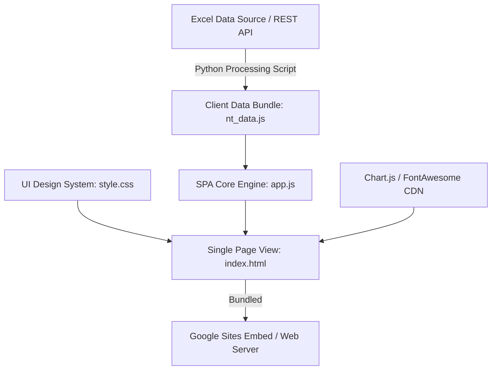

[web_app_spec_prd.md](https://github.com/user-attachments/files/32323631/web_app_spec_prd.md)
# เอกสารข้อกำหนดระบบและสถาปัตยกรรมซอฟต์แวร์ (Software Requirements Specification & PRD)
## ระบบแดชบอร์ดและวิเคราะห์ผลการทดสอบ Pre NT (Pre NT Analytics & Comparative Dashboard SPA)
**หน่วยงาน:** สำนักงานเขตพื้นที่การศึกษาประถมศึกษาขอนแก่น เขต 5  
**เวอร์ชันเอกสาร:** 1.0 (พร้อมรองรับการเปรียบเทียบพัฒนาการ ครั้งที่ 1 vs ครั้งที่ 2)  
**กลุ่มเป้าหมายนักพัฒนา:** Front-End Developers / Full-Stack Developers / Data Engineers

---

## 1. ภาพรวมระบบและวัตถุประสงค์ (Executive Summary)

ระบบแดชบอร์ดวิเคราะห์ผลการทดสอบ Pre NT เป็นเว็บแอปพลิเคชันรูปแบบ **Single Page Application (SPA)** ที่ออกแบบมาเพื่อประมวลผล แสดงผล และวิเคราะห์ผลการทดสอบระดับเขตพื้นที่การศึกษา (17 ศูนย์เครือข่าย 253 โรงเรียน นักเรียนกว่า 3,083 คน) เพื่อใช้ในการนิเทศ ติดตาม และยกระดับคุณภาพการศึกษา

### วัตถุประสงค์หลัก
1. แสดงผลการทดสอบเชิงลึกใน 3 ระดับ: **ระดับเขตพื้นที่การศึกษา**, **ระดับศูนย์เครือข่าย**, และ **ระดับรายโรงเรียน/รายบุคคล**
2. รองรับการกรองข้อมูลแบบมัลติมิติ (จำแนกตามประเภทเด็กปกติ/เด็กพิเศษ, แยกวิชาภาษาไทย/คณิตศาสตร์/รวม 2 วิชา)
3. ประมวลผลและจัดกลุ่มระดับคุณภาพนักเรียน (**ดีมาก / ดี / พอใช้ / ปรับปรุง**) อ้างอิงเกณฑ์มาตรฐาน สพฐ.
4. รองรับการวิเคราะห์เปรียบเทียบพัฒนาการ (**Progress & Growth Analytics**) เมื่อมีข้อมูลการทดสอบครั้งที่ 2 (Pre NT ครั้งที่ 2)
5. สามารถนำไปฝังใช้งานบน **Google Sites** หรือ เว็บโฮสติ้งของหน่วยงานได้ทันทีโดยไม่ต้องมีเซิร์ฟเวอร์ภายนอก (Self-Contained Client-Side Architecture)

---

## 2. สถาปัตยกรรมระบบและเทคโนโลยี (System Architecture & Tech Stack)



### Stack ที่กำหนดให้ใช้
- **Structure**: HTML5 (Semantic Elements, Accessible Structure)
- **Styling**: Vanilla CSS3 (CSS Custom Properties/Variables, Flexbox, Grid, Glassmorphism, Modern Gradients)
- **Logic Engine**: JavaScript ES6+ (Vanilla JS, No Heavy Framework Requirements for Maximum Speed & Portability)
- **Visualization**: Chart.js (v4.0+)
- **Typography & Icons**: Google Fonts (`Prompt` & `Inter`), FontAwesome 6 (Free CDN)
- **Data Bundle**: Client-Side JSON Object (`NT_DATA`)

---

## 3. โครงสร้างข้อมูลและสคีมา (Data Schemas & Data Model)

### 3.1 Student Schema (โครงสร้างข้อมูลนักเรียนรายบุคคล)
```typescript
interface Student {
  id: number;                 // รหัสนักเรียน (Internal ID)
  center: string;             // ชื่อศูนย์เครือข่าย (1 ใน 17 ศูนย์)
  school: string;             // ชื่อโรงเรียน (1 ใน 253 โรงเรียน)
  prefix: string;             // คำนำหน้าชื่อ (เด็กชาย / เด็กหญิง / นาย / นางสาว)
  name: string;               // ชื่อ - นามสกุล
  type: 'เด็กปกติ' | 'เด็กพิเศษ'; // ประเภทนักเรียน (Standardized)
  type_orig: string;          // ข้อความประเภทเด็กดั้งเดิมจาก Excel
  status: 'เข้าสอบ' | 'ขาดสอบ'; // สถานะการเข้าสอบ
  status_orig: string;        // ข้อความสถานะดั้งเดิม
  
  // วิชาภาษาไทย (Thai Language - Full Score 100)
  th_c: number;               // คะแนนแบบเลือกตอบ (ข้อ 1-26, เต็ม 78)
  th_s: number;               // คะแนนเขียนตอบสั้น (ข้อ 27-29, เต็ม 15)
  th_f: number;               // คะแนนเขียนตอบอิสระ (ข้อ 30, เต็ม 7)
  th_tot: number;             // รวมคะแนนภาษาไทย (เต็ม 100)
  th_level: 'ดีมาก' | 'ดี' | 'พอใช้' | 'ปรับปรุง' | 'ขาดสอบ';
  
  // วิชาคณิตศาสตร์ (Mathematics - Full Score 100)
  ma_c: number;               // คะแนนแบบเลือกตอบ (ข้อ 1-26, เต็ม 78)
  ma_s: number;               // คะแนนเขียนตอบสั้น (ข้อ 27-29, เต็ม 12)
  ma_f: number;               // คะแนนเขียนตอบอิสระ (ข้อ 30, เต็ม 10)
  ma_tot: number;             // รวมคะแนนคณิตศาสตร์ (เต็ม 100)
  ma_level: 'ดีมาก' | 'ดี' | 'พอใช้' | 'ปรับปรุง' | 'ขาดสอบ';
  
  // รวม 2 วิชา (Combined 2 Subjects - Full Score 200)
  tot_200: number;            // รวม 2 วิชา (เต็ม 200)
  tot_pct: number;            // ร้อยละรวม (0 - 100%)
  tot_level: 'ดีมาก' | 'ดี' | 'พอใช้' | 'ปรับปรุง' | 'ขาดสอบ';

  // [รองรับ Phase 2: การทดสอบครั้งที่ 2]
  test2?: {
    status: 'เข้าสอบ' | 'ขาดสอบ';
    th_tot: number;
    th_level: string;
    ma_tot: number;
    ma_level: string;
    tot_200: number;
    tot_pct: number;
    tot_level: string;
    growth_score: number;      // ผลต่างคะแนน (Test2 - Test1)
    growth_pct: number;        // อัตราการเติบโตร้อยละ
    growth_status: 'Improved' | 'Stable' | 'Declined';
  }
}
```

---

## 4. ตรรกะทางธุรกิจและเกณฑ์การประเมิน (Business Logic & Criteria Rules)

### 4.1 เกณฑ์การตัดสินระดับคุณภาพ NT (สพฐ.)
โปรแกรมเมอร์ **ต้อง** ใช้เกณฑ์การประเมินระดับคุณภาพแยกตามรายวิชาและคะแนนร้อยละตามตารางนี้เท่านั้น:

| ระดับคุณภาพ | วิชาคณิตศาสตร์ (ร้อยละ) | วิชาภาษาไทย (ร้อยละ) | รวม 2 ด้าน (ร้อยละ) |
| :-: | :-: | :-: | :-: |
| **ดีมาก (Excellent)** | 67.00 - 100.00 | 70.00 - 100.00 | 68.50 - 100.00 |
| **ดี (Good)** | 44.00 - 66.99 | 50.00 - 69.99 | 47.00 - 68.49 |
| **พอใช้ (Fair)** | 26.00 - 43.99 | 29.00 - 49.99 | 27.50 - 46.99 |
| **ปรับปรุง (Need Improvement)** | 0.00 - 25.99 | 0.00 - 28.99 | 0.00 - 27.49 |

#### Logic Implementation Function (JavaScript Example):
```javascript
function evaluateQualityLevel(percentage, subject) {
    const pct = Number(percentage);
    if (subject === 'th') {
        if (pct >= 70.0) return 'ดีมาก';
        if (pct >= 50.0) return 'ดี';
        if (pct >= 29.0) return 'พอใช้';
        return 'ปรับปรุง';
    } else if (subject === 'ma') {
        if (pct >= 67.0) return 'ดีมาก';
        if (pct >= 44.0) return 'ดี';
        if (pct >= 26.0) return 'พอใช้';
        return 'ปรับปรุง';
    } else { // 'both'
        if (pct >= 68.5) return 'ดีมาก';
        if (pct >= 47.0) return 'ดี';
        if (pct >= 27.5) return 'พอใช้';
        return 'ปรับปรุง';
    }
}
```

### 4.2 ตรรกะการจับคู่เปรียบเทียบพัฒนาการ (Test 1 vs Test 2 Matching Algorithm)
เมื่อป้อนข้อมูลการทดสอบครั้งที่ 2 เข้าสู่ระบบ ให้รันอัลกอริทึมจับคู่ดังนี้:
1. **Primary Key Matching**: `Center_Name + School_Name + Clean_String(Full_Name)`
2. **Growth Score Calculation**:
   $$\text{Growth Score} = \text{Score}_{\text{Test 2}} - \text{Score}_{\text{Test 1}}$$
3. **Growth Status Categorization**:
   - $\text{Growth Score} > +1.0 \Rightarrow \text{'Improved' (พัฒนาขึ้น)}$
   - $-1.0 \le \text{Growth Score} \le +1.0 \Rightarrow \text{'Stable' (คงที่)}$
   - $\text{Growth Score} < -1.0 \Rightarrow \text{'Declined' (ลดลง)}$

---

## 5. ข้อกำหนดฟังก์ชันและส่วนติดต่อผู้ใช้ (UI/UX Specification)

### 5.1 ระบบดีไซน์ (Design System: Vibrant EdTech Palette)
- **Primary Background**: `#F4F6FC`
- **Surface Card**: `#FFFFFF` (Border `#E2E8F0`, Radius `12px`, Shadow `0 4px 12px rgba(15, 23, 42, 0.08)`)
- **Header Banner Gradient**: `linear-gradient(135deg, #1E1B4B 0%, #312E81 35%, #2563EB 70%, #0D9488 100%)`
- **Subject Accent Colors**:
  - **ภาษาไทย**: Emerald Green (`#059669`) / Light Bg (`#D1FAE5`)
  - **คณิตศาสตร์**: Electric Blue (`#2563EB`) / Light Bg (`#DBEAFE`)
  - **รวม 2 วิชา**: Royal Purple (`#7C3AED`) / Light Bg (`#EDE9FE`)
- **Quality Level Badges**:
  - **ดีมาก**: BG `#D1FAE5`, Text `#059669`, Icon `fa-star`
  - **ดี**: BG `#DBEAFE`, Text `#2563EB`, Icon `fa-thumbs-up`
  - **พอใช้**: BG `#FEF3C7`, Text `#D97706`, Icon `fa-minus`
  - **ปรับปรุง**: BG `#FEE2E2`, Text `#DC2626`, Icon `fa-triangle-exclamation`

### 5.2 แถบตัวกรองลอย (Floating Filter Bar)
ต้องมีคอนโทรลต่อไปนี้ และต้องตอบสนองการเปลี่ยนแปลงแบบ Real-time:
1. **Segmented Control - ประเภทนักเรียน**: `ทั้งหมด` | `เด็กปกติ` | `เด็กพิเศษ`
2. **Segmented Control - วิชาที่แสดง**: `รวม 2 วิชา` | `ภาษาไทย` | `คณิตศาสตร์`
3. **Select Dropdown - ศูนย์เครือข่าย**: ดรอปดาวน์เลือก 17 ศูนย์เครือข่าย (อัปเดตตัวเลือกโรงเรียนในดรอปดาวน์ถัดไปอัตโนมัติ)
4. **Select Dropdown - โรงเรียน**: ดรอปดาวน์เลือกโรงเรียนตามศูนย์เครือข่ายที่เลือก
5. **Search Input**: ช่องค้นหาข้อความ (พิมพ์ชื่อโรงเรียน หรือ ชื่อนักเรียนเพื่อกรองข้อมูลทันที)
6. **Reset Button**: ปุ่มคืนค่าตัวกรองเป็นค่าเริ่มต้น

### 5.3 แผงการ์ดสรุปตัวเลขสถิติ (KPI Stat Cards)
แสดงผล 4 การ์ดหลัก:
- **Card 1 (ผู้เข้าสอบทั้งหมด)**: แสดงจำนวนผู้เข้าสอบจริง / จำนวนนักเรียนทั้งหมด / อัตราการเข้าสอบ %
- **Card 2 (คะแนนเฉลี่ยรวม 2 วิชา)**: คะแนนเฉลี่ยเต็ม 200 / ร้อยละเฉลี่ย / ป้ายระดับคุณภาพรวม
- **Card 3 (คะแนนเฉลี่ยภาษาไทย)**: คะแนนเฉลี่ยเต็ม 100 / ร้อยละเฉลี่ย / ป้ายระดับคุณภาพภาษาไทย
- **Card 4 (คะแนนเฉลี่ยคณิตศาสตร์)**: คะแนนเฉลี่ยเต็ม 100 / ร้อยละเฉลี่ย / ป้ายระดับคุณภาพคณิตศาสตร์

### 5.4 การ์ดแสดงเกณฑ์มาตรฐาน (Collapsible Criteria Card)
การ์ดขอบสีเข้ม `#9F1239` ด้านบนสุดของแดชบอร์ด สามารถกดซ่อน/แสดงตารางเกณฑ์ตัดสินระดับคุณภาพ NT (4 ช่วงคะแนน x 3 วิชา) ได้ตลอดเวลา

### 5.5 ระบบแท็บแสดงผล 3 มุมมอง (3 Main Navigation Views)

#### Tab 1: ภาพรวมระดับเขตพื้นที่การศึกษา (District Overview Panel)
- **Quality Summary Grid**: 4 การ์ดสรุปจำนวนนักเรียนและ % ของแต่ละระดับคุณภาพ (ดีมาก/ดี/พอใช้/ปรับปรุง)
- **Chart 1 (Chart.js Bar Chart)**: แผนภูมิแท่งเปรียบเทียบคะแนนเฉลี่ย 17 ศูนย์เครือข่าย
- **Chart 2 (Chart.js Doughnut Chart)**: แผนภูมิโดนัทสัดส่วนระดับคุณภาพนักเรียนทั้งเขต
- **Table 1 (Centers Ranking Table)**: ตารางจัดอันดับ 17 ศูนย์เครือข่าย (แสดงอันดับ, ชื่อศูนย์, จำนวนโรงเรียน, ผู้เข้าสอบ, คะแนนเฉลี่ย TH, MA, Both, ร้อยละ, ป้ายระดับคุณภาพ, ปุ่ม "ดูข้อมูล")

#### Tab 2: ภาพระดับศูนย์เครือข่าย (Network Center View Panel)
- **Interactive Center Cards Grid**: แผงการ์ด 17 ศูนย์เครือข่าย แสดงคะแนนเฉลี่ย TH/MA/Both คลิกเลือกเพื่อสลับดูข้อมูลเจาะลึก
- **Selected Center Detail Card**:
  - แผนภูมิแท่งเปรียบเทียบคะแนนโรงเรียนภายในศูนย์ที่เลือก
  - ตารางแสดงคะแนนเฉลี่ยรายโรงเรียนภายในศูนย์ พร้อมปุ่ม "นักเรียน" เพื่อเปิด Modal เจาะลึก

#### Tab 3: ภาพรายโรงเรียน & ข้อมูลนักเรียน (School & Student View Panel)
- **Table 2 (Schools Leaderboard Table)**: ตารางแสดง 253 โรงเรียน
  - รองรับการคลิกหัวคอลัมน์เพื่อเรียงลำดับข้อมูล (**Sorting**: Ascending / Descending)
  - มีระบบเปลี่ยนหน้า (**Pagination**: 15 รายการต่อหน้า)
  - ปุ่ม **"เจาะลึก"** เปิด Modal รายชื่อนักเรียน
- **School Drill-Down Modal (หน้าต่างป๊อบอัพเจาะลึกรายโรงเรียน)**:
  - หัว Modal แสดงชื่อโรงเรียนและศูนย์เครือข่าย
  - 4 การ์ดเล็กสรุปสถิติผู้เข้าสอบและคะแนนเฉลี่ยของโรงเรียนนั้น
  - ช่องค้นหาชื่อนักเรียนภายในโรงเรียน
  - ตารางรายชื่อนักเรียนแสดงคะแนน TH (100), MA (100), ทั้งหมด (200) พร้อม **ป้ายระดับคุณภาพรายบุคคล**

---

## 6. ข้อกำหนดการส่งออกข้อมูลและการพิมพ์ (Export & Print Engine)

1. **Export CSV Engine**:
   - เมื่อคลิกปุ่ม "ส่งออกข้อมูล CSV" ระบบต้องดึงข้อมูลนักเรียนที่ผ่านตัวกรองปัจจุบันมาสร้างเป็นไฟล์ CSV
   - ต้องเติม **UTF-8 BOM (`\uFEFF`)** นำหน้าไฟล์ CSV เสมอ เพื่อให้ Microsoft Excel เปิดภาษาไทยได้โดยไม่เป็นภาษาต่างด้าว
2. **Print PDF Engine**:
   - เมื่อคลิกปุ่ม "พิมพ์รายงาน PDF" ระบบต้องสั่ง `window.print()`
   - มี CSS `@media print` ซ่อนแถบตัวกรอง ปุ่มกด และระบบเปลี่ยนหน้า เพื่อแสดงเฉพาะการ์ดและตารางรายงานอย่างสวยงาม

---

## 7. ข้อกำหนดการบันทึกไฟล์เป็น Single File (Google Sites Bundling)

โปรแกรมเมอร์ **ต้อง** เขียนสคริปต์สำหรับการ Bundle รวมไฟล์ทั้งหมด (`index.html`, `style.css`, `nt_data.js`, `app.js`) ให้อยู่ในรูปแบบไฟล์ HTML เดี่ยวสมบูรณ์:
- **Output File**: `google_sites_embed.html`
- Inline CSS ไว้ใน `<style>...</style>`
- Inline Dataset และ Application Logic ไว้ใน `<script>...</script>`
- ใช้ CDN HTTPS สำหรับ Chart.js, Google Fonts, และ FontAwesome
- สามารถ Copy โค้ดทั้งหมดไปวางในช่อง **Embed Code (`< >`)** บน Google Sites ได้ทันทีโดยไม่ติดขัดปัญหา CORS หรือ External File Hosting

---

## 8. แผนผังโครงสร้างไฟล์โครงการ (Project File Structure)

```text
/033 Pre NT
│
├── index.html                 # โครงสร้างหน้าเว็บ SPA หลัก
├── style.css                  # สไตล์ดีไซน์ Vibrant EdTech Palette
├── app.js                     # ตรรกะแอปพลิเคชัน การคำนวณสถิติ และ Chart.js
├── nt_data.js                 # Dataset โครงสร้างนักเรียน 3,083 คน (JSON)
├── google_sites_embed.html    # ไฟล์ Single Bundle สำหรับฝัง Google Sites
│
├── build_dashboard_data.py    # สคริปต์ Python สกัด Excel -> nt_data.js
├── bundle_google_sites.py     # สคริปต์ Python รวมไฟล์ HTML/CSS/JS -> Single Bundle
└── สรุปผลการทดสอบ NT_ผสาน 17 ศูนย์เครือข่าย_แยกวิชา.xlsx # ไฟล์ข้อมูล Excel ต้นทาง
```

---

## 9. ตารางสรุป Check-list สำหรับการส่งมอบงาน (Definition of Done)

- [x] โครงสร้างสกัดข้อมูลจากไฟล์ Excel ครบถ้วน 3,083 คน 17 ศูนย์ 253 โรงเรียน
- [x] ตรรกะตัดเกณฑ์ระดับคุณภาพตรงตามเกณฑ์มาตรฐาน สพฐ. (TH, MA, Both)
- [x] ระบบตัวกรองมัลติมิติ (ประเภทเด็ก, วิชา, ศูนย์เครือข่าย, โรงเรียน, ค้นหา) ทำงานแบบ Real-time
- [x] แผนภูมิ Chart.js 3 ชุด (เปรียบเทียบศูนย์, สัดส่วนคุณภาพ, เปรียบเทียบโรงเรียนในศูนย์) แสดงผลถูกต้อง
- [x] Modal เจาะลึกรายโรงเรียนแสดงป้ายระดับคุณภาพรายบุคคลถูกต้อง
- [x] ระบบ Export CSV ภาษาไทยเปิดใน Excel ได้ไม่เพี้ยน
- [x] สร้างไฟล์ `google_sites_embed.html` สำหรับฝังบน Google Sites เรียบร้อย
